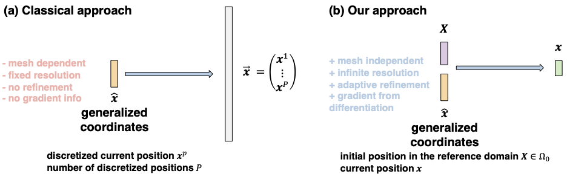
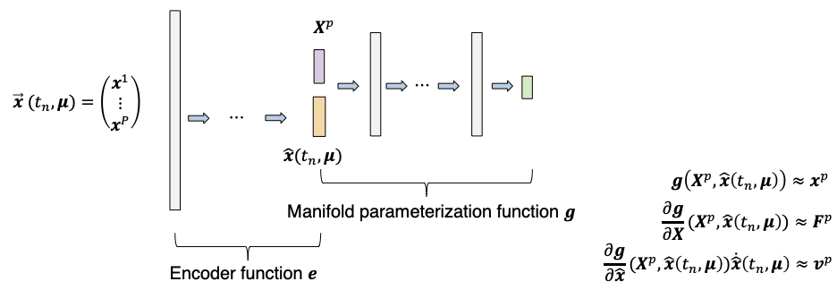
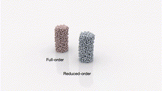
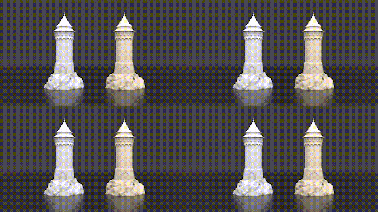
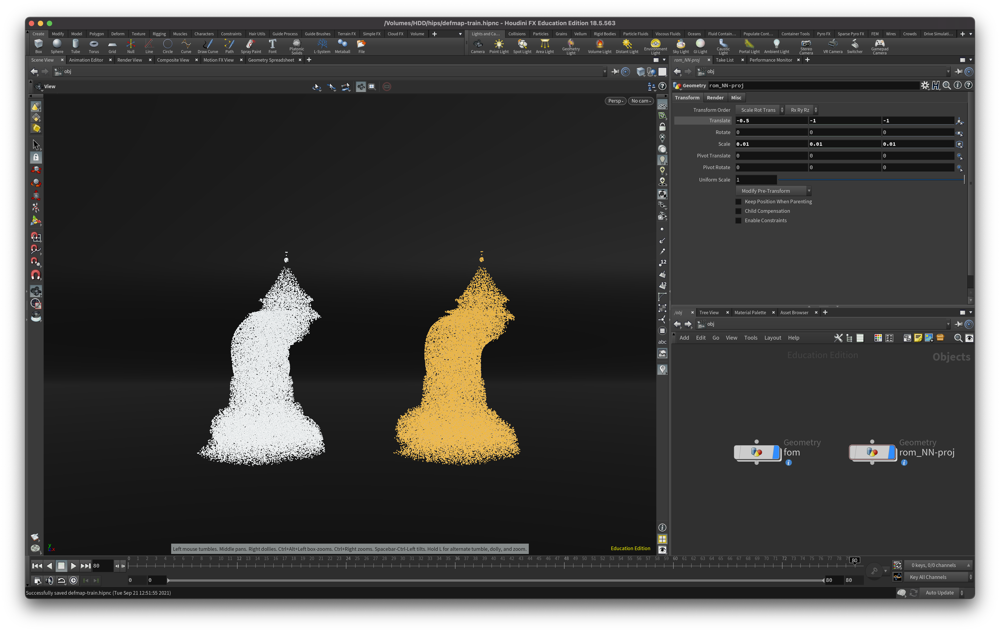

# libNeuralDefMap

libNeuralDefMap is an open source project for the neural representation of the deformation map of continuum mechanics. In particular, it has been used for the machine learning acceleration of the material point method, a popular physics simulation framework. Check out the project page and the paper for details: https://peterchencyc.com/projects/rom4mpm/

<p align="center">

</p>

In classical model reduction techniques, a mapping from the generalized coordinates is often trained to infer the deformed positions of a finite number of particles concatenated into a column vector. By contrast, our approach builds a manifold-parameterization function that maps the generalized coordinates and an arbitrary undeformed position to its current, deformed position.

<p align="center">

</p>

The manifold parameterization function is constructed via a neural network. With a continuously differentiable activation function, we also obtain the approximated deformation gradient and the approximated velocity. An encoder network is used for generating the generalized coordinates from the simulation snapshot.

Note that this open source project only contains the source code for the kinematics approximation of the deformation map. For dynamics evolution, please refer to Section 3.2 of the paper.

## Dependencies
* [PyTorch](PyTorch)
<!-- ```
pip install torch
``` -->
* [h5py](https://www.h5py.org): A binary file format for storing simulation data.
<!-- ```
pip install h5py
``` -->

## Train
```
python3 train.py -d sim_data_parent_directory -lr 1.0 0.1 0.01 0.001 -epo 500 200 100 50 -lbl 6 -alr -train_ratio 1.0 -optimizer adam -print_every 5 -save_every 250 -cgv 0.01 -cdm 100
```

### Data 
Simulation data should be stored in a directory with the following structure. 
For example, 
```
├───sim_data_parent_directory (contain multiple simulation sequences; each entry in this directory is a simulation sequence)
    ├───sim_seq_ + suffix
        ├───h5_f_0000000000.h5
        ├───h5_f_0000000001.h5
        ├───...
        
    ├───....
```
See SimulationData.py for the structure of the h5 file.

Sample data (including continual manipulation and tower deformation) can be downloaded from https://www.dropbox.com/sh/nfiv3mv29uuckgx/AAC5joZJS4YoiYnoBeOLepUra?dl=0

<p align="center">


</p>

<p align = "center">
Continual manipulation (Section 5.3.2) and tower deformation (Section 5.4)
</p>

## Test
```
python3 test.py -d sim_data_parent_directory -lbl 6 -m path_to_trained_network_weights -et train -train_ratio 1.0 -recover
```
Sequences of deformations are generated. Each of the deformation is a reconstruction of the original deformation by the nerual deformation map. Testing deformations (unseen during training) can also be generated by tweaking the training and testing options. Use the --help option for details.

## Visualize in Houdini
### h5 file
Install houdini/importPoints.hda (contained in the repo) using the guide: https://www.sidefx.com/docs/houdini/assets/install.html

To use this asset, you need to install h5py on Houdini's python. You can do it by following the guides below by replacing scipy with h5py.

mac/linux: https://cseweb.ucsd.edu/~alchern/teaching/houdini/

windows: http://wordpress.discretization.de/houdini/home/advanced-2/installing-and-using-scipy-in-houdini/

After that, open houdini and create a geo node. Inside the geo node, call importPoints. This would allow you to read sequence of h5 files.

Below is an example (Houdini 18.5) where two sequences of h5 files are read.

<p float="left">

</p>


## Citation
If this library helped you in a publication, please cite our paper so others can find our code and benefit as well.
```
@article{chen2021model,
  title={Model reduction for the material point method via an implicit neural representation of the deformation map},
  author={Chen, Peter Yichen and Chiaramonte, Maurizio and Grinspun, Eitan and Carlberg, Kevin},
  journal={arXiv preprint arXiv:2109.12390},
  year={2021}
}
```

## Contact
Feel free to reach out to us if you have any question! We would love to get in touch.
